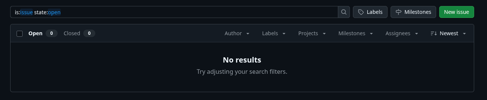
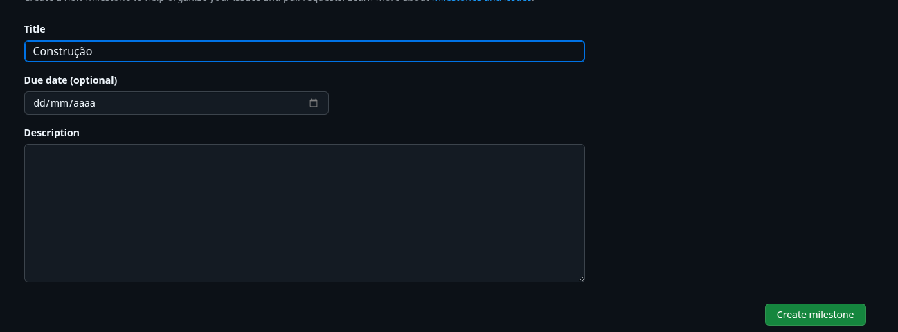
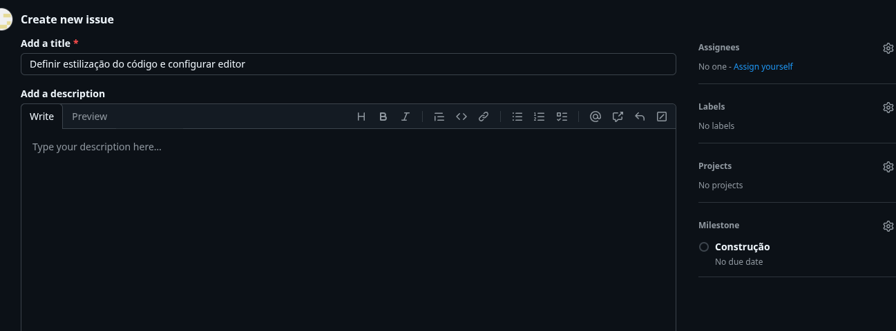
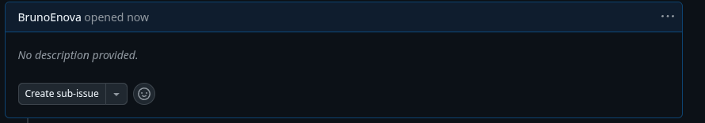

# Aula 2

## Criar milestone contrução

- Criar milestone - Contrução
  
  

- Criar issues - Definir estilização do código e configurar editor 
  

- Criar sub-issues - Definir estilização do código e configurar editor 
    - Ligar sincronização do Editor
    - Configurar o EditorConfig
    - Configurar o Prettier
  