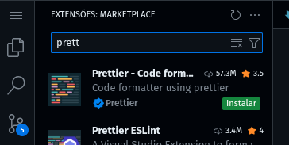

# Aula 4

## Use o Prettier para manter o estilo do código consistente.

- Execute o seguinte comando:

  ```cmd
     npm init
  ```

  > O npm (Node Package Manager) é o gerenciador de pacotes padrão do Node.js.
  >
  > - Instalar pacotes (bibliotecas)
  > - Gerenciar dependências
  > - Executar scripts
  > - Publicar pacotes

O **package.json** é frequentemente chamado de manifesto do projeto porque ele:

| Campo             | Descrição                                                       |
| ----------------- | --------------------------------------------------------------- |
| `name`            | Nome do projeto/pacote.                                         |
| `version`         | Versão do projeto.                                              |
| `scripts`         | Comandos personalizados que podem ser executados com `npm run`. |
| `dependencies`    | Pacotes necessários para rodar o projeto.                       |
| `devDependencies` | Pacotes usados apenas durante o desenvolvimento.                |
| `main`            | Arquivo de entrada principal do projeto.                        |

> JSON (JavaScript Object Notation) é um formato leve de troca de dados que é fácil de ler e escrever para os humanos e fácil de analisar e gerar para as máquinas. Ele é baseado em texto e utilizado para representar dados estruturados de forma simples e compacta.

- Crie o arquivo index.js, que será o arquivo de inicialização do projeto. A partir dele, o nosso programa será iniciado.

- Instalar o Prettier como uma dependência de desenvolvimento.

  ```cmd
    npm i -D prettier
  ```

- O diretório node_modules é onde o Node.js armazena todas as dependências de um projeto. Quando você instala pacotes com o npm (Node Package Manager), por exemplo, os arquivos desses pacotes são baixados e armazenados dentro da pasta node_modules.

- Ignorar a pasta node_modules no rastreamento do Git.

  - Criar arquivo `.gitignore`

  ```.gitignore
  node_modules
  ```

  > O .gitignore é um arquivo de configuração utilizado em projetos Git para informar ao sistema de controle de versão Git quais arquivos ou pastas não devem ser rastreados (ou seja, não devem ser adicionados ao repositório).

- Criar scripts

  ```json
  "scripts": {
    {
      ...
      "lint:prettier:check": "prettier --check .",
      "lint:prettier:fix": "prettier --write .",
      ...
    }
  }

  ```

  > Check: Verifica se os arquivos estão formatados de acordo com o Prettier. Não altera os arquivos. Retorna erro se algo estiver fora do padrão.
  > Fix: Formata automaticamente todos os arquivos no diretório.
  > O sistema não reconhece prettier como um comando global (fora do projeto).
  > Mas o npm scripts sabe procurar comandos dentro da pasta node_modules/.bin, onde o Prettier está.

- Configurar a ide para usar prettier como formatador padrão
  
  
  
  
